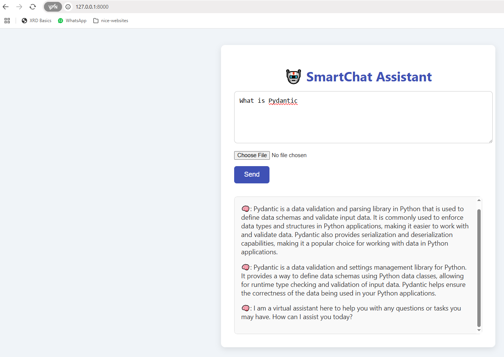

# chatbot

This chatbot app is built using FastAPI.
(Langchain is not used)

Before running the app, make sure that you mention open-ai api key

**Command to run the app :**
1. First switch to backend folder
2. then run the following command:
`uvicorn main:app --reload`

**Output:**

